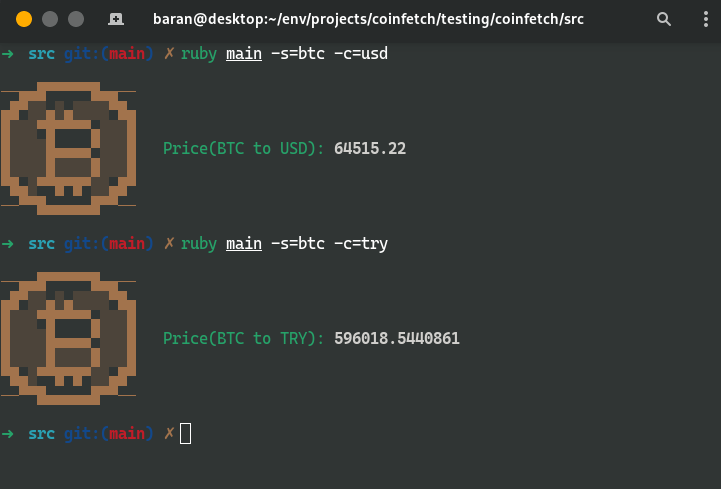
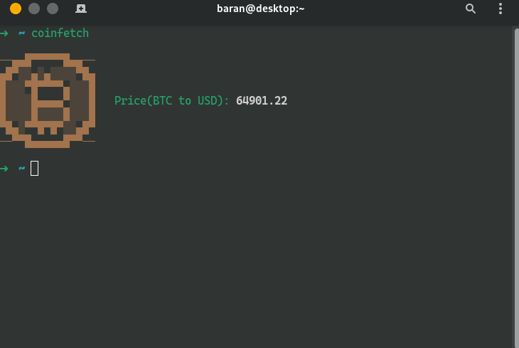

# coinfetch
Coinfetch is a tool for printing your favorite coin's price to your terminal.
# Usage
```
ruby main.rb -s=<symbol of the coin> -c=<currency, usd, try etc.>
```

<h1>Gallery</h1>
<div align="center">

  <hr>

</div>

